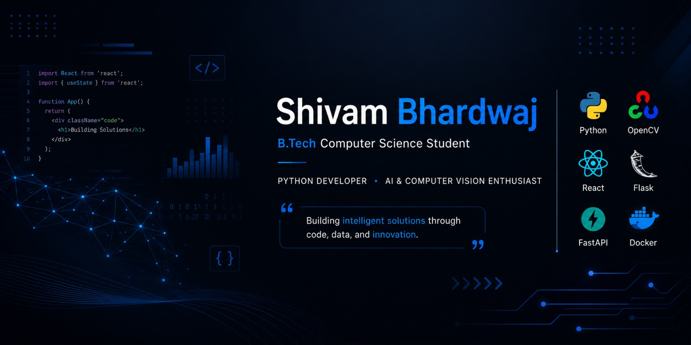

# Hi, I'm Shivam Bhardwaj 👋

🎓 Computer Science Undergraduate at Accurate Institute of Management and Technology

💻 Passionate about Python Development, Computer Vision, and Artificial Intelligence

🚀 Building real-time applications using OpenCV, MediaPipe, Flask, and FastAPI

---

## 🔧 Tech Stack

**Languages**

* Python
* Java
* C
* SQL
* JavaScript

**Frameworks & Technologies**

* React
* Flask
* FastAPI

**Libraries**

* OpenCV
* MediaPipe
* Pandas
* NumPy
* Matplotlib

**Developer Tools**

* Git
* Docker
* VS Code
* PyCharm
* Google Cloud Platform

---

## 🚀 Featured Projects

### PoseFit AI

Real-time exercise form analyzer using OpenCV and MediaPipe to detect body posture and evaluate exercise techniques.

### Student Behaviour Analyzer

Python-based analytics tool that processes student performance data and generates meaningful visual insights.

---

## 🌱 Currently Learning

* Data Structures & Algorithms
* Backend Development
* Computer Vision Applications
* System Design Fundamentals

---

## 📫 Connect With Me

* LinkedIn: https://www.linkedin.com/in/shivam-bhardwaj19
* Email: [shivambhardwajtech19@gmail.com](mailto:shivambhardwajtech19@gmail.com)

